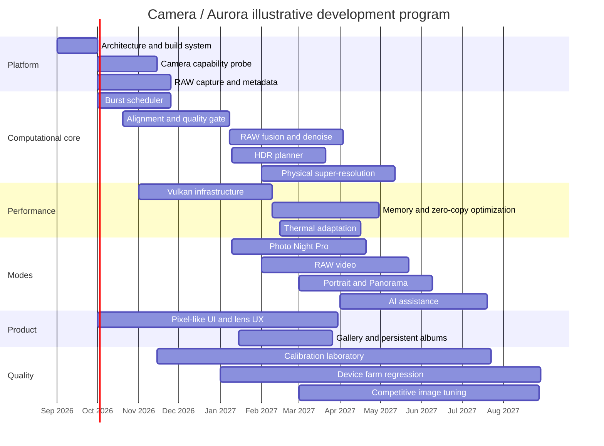
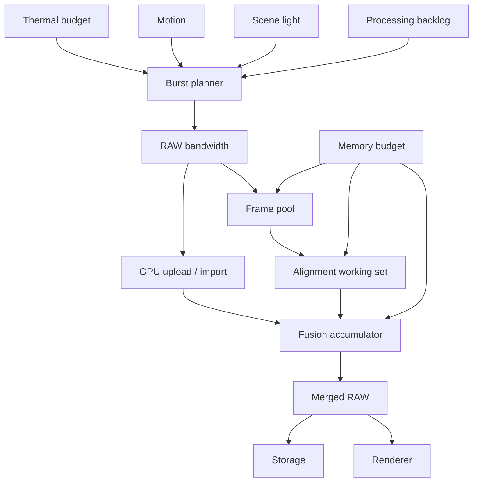

# Camera: Research-Grade Architecture and Implementation Plan for a RAW-First Android Computational Camera

## Executive summary and feasibility boundary

The proposed application, **Camera**, should be designed as a **RAW-first computational-photography system**, not as a conventional Camera2 application that captures JPEG/HEIF and then edits it. The recommended architecture is to use Android Camera2 for public camera control and `RAW_SENSOR` acquisition, keep the canonical photographic data in the Bayer/CFA domain for as long as possible, perform burst planning, frame rejection, registration, radiometric normalization, denoising, HDR fusion and—where physically justified—multi-frame super-resolution in an application-owned native pipeline, and treat display rendering as a separate non-destructive process. Android explicitly describes `RAW_SENSOR` as a general raw sensor format, normally a single-channel Bayer mosaic, and `DngCreator` can write either Camera2 `RAW_SENSOR` buffers or Bayer-type raw pixel data generated by the application. citeturn18search14turn18search3

The central technical recommendation is:

> **Never make JPEG, HEIF, OEM HDR extensions, or the OEM post-processing pipeline the source of truth. The source of truth is a collection of sensor RAW frames plus complete capture metadata.**

This is feasible on cameras that advertise `REQUEST_AVAILABLE_CAPABILITIES_RAW`. It is **not universally possible on every Android camera or every auxiliary lens**. Camera2 `FULL` does not guarantee RAW; RAW is optional even for FULL devices, whereas `LEVEL_3` includes RAW capture. Applications therefore have to build a capability database per physical lens and per mode rather than assume that every advertised camera ID can deliver RAW. citeturn20search10turn18search12

There is a second important limitation. Android can expose a logical camera while hiding one or more physical cameras from the normal camera-ID list. Since Android 10/API 29, a physical camera behind a logical multi-camera may not be independently openable, although its characteristics and mandatory physical stream configurations can still be exposed through the logical device. Therefore Camera should **not try to bypass OEM camera visibility restrictions**; it should discover logical/physical topology and access hidden physical sensors through standards-compliant physical streams where the HAL permits it. citeturn18search0turn19search2

A third boundary affects the requested “forced 4K” and “forced FPS.” Camera2 exposes supported stream sizes, high-speed combinations and minimum frame duration. High-resolution output sizes may explicitly be unable to operate at full burst rate. Software cannot force a sensor or HAL to read out a resolution/FPS combination that the hardware does not provide. Camera can, however, expose clearly labelled **Synthetic 4K**, **Synthetic 60/120/240 fps**, or **Super-Resolution 4K** modes produced by application-side reconstruction/interpolation, while falling back to the nearest real sensor mode. citeturn22search2

The same distinction must be applied to RAW video. A genuine RAW-video mode is possible only when a RAW stream can be delivered at an adequate frame interval and storage bandwidth. On other devices, Camera should report **“RAW video unsupported on this lens at this frame rate”** rather than silently switch to vendor-processed YUV and call it RAW. Existing projects such as MotionCam demonstrate that an Android application can build an application-owned RAW capture/computational pipeline, but their implementation is a reference rather than proof that all Android hardware supports the same RAW frame rates. citeturn21search0turn21search32

The user's highlight, shadow, saturation and sharpening controls require one conceptual adjustment. Saturation, conventional sharpening and tone mapping are fundamentally operations on a rendered color image, not on an untouched Bayer mosaic. To maintain the “RAW only” requirement correctly, Camera should save:

**Sensor RAW → computational/merged RAW → immutable canonical RAW**

and separately save:

**non-destructive Render Recipe → demosaic/color/tone/shadows/highlights/saturation/sharpness/upscale settings**.

This is analogous to treating the raw file as a digital negative rather than burning an aesthetic look into the sensor samples. Adobe describes DNG as an archival format for camera RAW information, while Android describes DNG as sensor pixel data with minimal preprocessing and metadata necessary for later conversion. citeturn15search0turn18search3

The resulting product should therefore have two related engines:

| Engine | Purpose | Canonical output |
|---|---|---|
| **Aurora Capture Engine** | Sensor control, adaptive bursts, frame quality, RAW alignment, HDR/NR/SR fusion | `.auraw` / optional DNG |
| **Aurora Render Engine** | Demosaic, color, tone mapping, shadows, highlights, saturation, sharpening, screen preview | Cached preview only; settings stored as recipe |
| **Aurora Video Engine** | RAW frame stream, timing, gyro, optional lossless compression | `.aurv` |
| **Aurora AI Engine** | Motion masks, semantic masks, denoise/deblur/SR assistance | Never replaces original RAW |
| **Camera UI** | Pixel-like controls, per-lens profiles, lens transition UX, gallery | No image-quality logic |

Google's foundational HDR+ research is directly relevant. Hasinoff et al. captured full-resolution Bayer RAW frames, deliberately avoided the ISP's spatial denoising and tone mapping, aligned bursts and merged them using an FFT-based registration strategy and a hybrid Wiener filtering approach. Their work was implemented with Camera2 and Halide. citeturn16search0 Google's later handheld multi-frame super-resolution work aligns and merges CFA RAW frames while exploiting small subpixel offsets from natural hand motion, producing increased spatial resolution and SNR while remaining robust to local motion and occlusion. citeturn16search1

The goal “compete with iPhone/Pixel/Samsung” should be treated as a **measurement objective**, not as something architecture alone can guarantee. First-party camera applications benefit from device-specific calibration, proprietary ISP knowledge, private tuning and integration that a universal third-party app cannot assume. Android's HAL separates app-facing Camera2 from the underlying proprietary camera implementation, and vendor extensions may themselves override capture parameters. citeturn18search5turn20search0 The practical route to flagship quality is therefore a combination of a strong general RAW pipeline, automatic device profiling, and a growing library of per-device/per-lens calibration profiles.

## Research foundation, source priority, and technology choices

The research program should deliberately separate **normative sources**, **algorithmic research**, **vendor architectural references**, and **open-source implementation references**. Vendor leaks should not be copied into the project: if proprietary material appears publicly without authorization, use it only as a pointer to questions that can subsequently be verified from lawful documentation, hardware experiments or independent clean-room work.

### Prioritized source map

| Priority | Source | Why it matters |
|---|---|---|
| Critical | [Android Camera2 overview](https://developer.android.com/media/camera/camera2) | Public low-level application camera API and baseline architecture. citeturn21search18 |
| Critical | [AOSP Camera HAL](https://source.android.com/docs/core/camera/camera3) | Defines relationship between Camera2, HAL and hardware; AIDL HAL is the direction for Android 13+. citeturn18search2 |
| Critical | [AOSP Camera API version/capability support](https://source.android.com/docs/core/camera/versioning) | Explains LIMITED/FULL/LEVEL_3 and explicitly notes RAW is optional on FULL. citeturn20search10 |
| Critical | [Android multi-camera API](https://developer.android.com/media/camera/camera2/multi-camera) | Logical/physical lens discovery and physical stream model. citeturn19search2 |
| Critical | [Android NDK Camera reference](https://developer.android.com/ndk/reference/group/camera) | Physical-camera behavior, hidden physical cameras and low-level native access. citeturn18search0 |
| Critical | [Android DngCreator](https://developer.android.com/reference/android/hardware/camera2/DngCreator) | Standards-compatible RAW output path and application-generated Bayer RAW support. citeturn18search3 |
| Critical | [Adobe DNG](https://helpx.adobe.com/camera-raw/digital-negative.html) | Current public DNG specification family; Adobe lists DNG 1.7.1.0 as the current downloadable specification on its DNG resource page. citeturn15search0 |
| Critical | [Hasinoff et al., Burst Photography for HDR and Low Light](https://research.google/pubs/burst-photography-for-high-dynamic-range-and-low-light-imaging-on-mobile-cameras/) | Foundation for RAW burst fusion/HDR+/denoise/alignment. citeturn16search0 |
| Critical | [Wronski et al., Handheld Multi-Frame Super-Resolution](https://research.google/pubs/handheld-multi-frame-super-resolution/) | Foundation for physically grounded burst super-resolution. citeturn16search1 |
| High | [HDR+ with Bracketing](https://research.google/blog/hdr-with-bracketing-on-pixel-phones/) | Practical hybrid short/long-exposure burst strategy and adaptive frame count. citeturn17search0 |
| High | [Debevec & Malik HDR](https://www.pauldebevec.com/Research/HDR/) | Classic multi-exposure radiance fusion research. citeturn17search2 |
| High | [Learning to See in the Dark](https://openaccess.thecvf.com/content_cvpr_2018/html/Chen_Learning_to_See_CVPR_2018_paper.html) | Raw-domain learning research for extreme low-light imaging. citeturn16search2 |
| High | [Camera ITS](https://source.android.com/docs/compatibility/cts/camera-its) | Repeatable Android camera functional testing framework and test-scene methodology. citeturn15search6 |
| High | [Android Vulkan migration guidance](https://developer.android.com/guide/topics/renderscript/migrate/migrate-vulkan) | Official path for NDK GPU compute and AHardwareBuffer/Vulkan integration. citeturn22search6 |
| High | [AHardwareBuffer NDK](https://developer.android.com/ndk/reference/group/a-hardware-buffer) | Shared/zero-copy buffers and Vulkan external-memory interoperability. citeturn22search3 |
| High | [NNAPI migration guide](https://developer.android.com/ndk/guides/neuralnetworks/migration-guide) | NNAPI is deprecated; guides current on-device ML direction. citeturn22search0 |
| Reference | [Android camera-samples](https://github.com/android/camera-samples) | Current official sample implementations for Camera2/CameraX features. citeturn21search2 |
| Reference | [MotionCam](https://github.com/f0enix/motioncam) | Open implementation reference for application-owned RAW computational photography. citeturn21search0 |
| Reference | [Open Camera](https://opencamera.org.uk/) | Mature cross-device reference for Camera2 RAW, HDR, bracketing, panorama and manual controls. citeturn21search17 |
| Reference | [Qualcomm camera-service](https://github.com/qualcomm/camera-service) | Public Qualcomm/CamX-oriented architecture reference; not a universal Android-app interface. citeturn21search3 |
| Reference | [Qualcomm Linux camera driver](https://github.com/qualcomm-linux/camera-driver) | Public kernel-side Qualcomm camera implementation reference. citeturn21search7 |

The historical CodeAurora/CAF ecosystem is useful for understanding Qualcomm camera architecture, but a modern Play-distributed application should not be architected around private CamX/CHI calls. Qualcomm's currently public `camera-service` describes a Linux service that loads CamX and talks to a HAL3 backend; that is useful for studying layering but is **not an Android SDK contract available universally to third-party apps**. Android's own AIDL documentation likewise makes clear that HAL AIDL is a platform implementation mechanism, not an application SDK API. citeturn21search3turn18search19

### API and HAL choice

| Interface | RAW access | Manual sensor control | Aux/physical cameras | Vendor post-processing | Portability | Role in Camera |
|---|---:|---:|---:|---:|---:|---|
| Camera2 | Yes when advertised | Excellent | Best public Java/Kotlin API | Optional | High | **Primary control API** |
| NDK Camera | Yes when advertised | Excellent | Strong physical-camera controls | Optional | High | Optional native backend/performance path |
| CameraX | Increasing capability, abstraction focused | Less direct | Easier but abstracted | Often integrated | Very high | Viewfinder/helper features only |
| Camera2 Extensions | Vendor dependent | Restricted/extension-defined | Vendor dependent | **Yes** | Medium | Disabled in Pure RAW mode |
| CameraX Extensions | Vendor dependent | Abstracted | Vendor dependent | **Yes** | Medium | Optional compatibility mode |
| Camera HAL AIDL/HIDL | Full platform control | Platform implementation | Full OEM control | Full | OEM only | **Not directly accessed by normal app** |
| CamX/CHI/private vendor HAL | Device specific | Potentially deep | Device specific | Full | Very low | OEM partnership build only |

Camera Extensions should not power the core product. Android explicitly states that extension sessions often implement multi-frame vendor processing and may override application capture parameters; extension sessions are also more constrained than ordinary Camera2 sessions. citeturn20search0 Extensions can expose OEM HDR, Night, Bokeh and other processing, but video is not part of the regular extension use cases. citeturn20search1turn20search3 Therefore make extensions an optional **“OEM Processing”** compatibility switch, entirely separate from **Aurora RAW**.

The application should ship in two architectural flavors:

| Build | Hardware access | Distribution |
|---|---|---|
| `camera-universal` | Public Camera2/NDK APIs only | Play Store/F-Droid/OEM-neutral |
| `camera-oem` | Optional vendor-documented metadata/privileged integration | Signed OEM partnership builds |
| `camera-lab` | Diagnostics, RAW dumps, capability explorer, calibration tools | Internal/research only |

This prevents a device-specific optimization from contaminating the universal codebase.

## Architecture, hardware interfacing, and camera discovery

The recommended application baseline is **Kotlin + Jetpack Compose for UI/state**, a thin Camera2 control layer in Kotlin, and a **C++20 NDK computational core** for the high-cost image path. Vulkan compute should be the principal portable GPU backend. Android's current migration documentation directs compute-heavy RenderScript-style workloads toward Vulkan, and AHardwareBuffer can be imported into Vulkan as external memory where the device/buffer combination supports it. citeturn22search6turn22search3

NNAPI should not be chosen for the new AI layer: Android deprecated NNAPI in Android 15 and currently points developers toward TensorFlow Lite/updated on-device runtimes and GPU acceleration instead. citeturn22search0

A practical repository layout would be:

```text
Camera/
├── app/
│   ├── ui/
│   ├── navigation/
│   ├── settings/
│   └── dependency-injection/
│
├── camera-core/
│   ├── camera2/
│   ├── capabilities/
│   ├── session/
│   ├── physical-lenses/
│   ├── capture-sequencer/
│   ├── metering/
│   └── metadata/
│
├── aurora-core/
│   ├── include/
│   ├── raw/
│   ├── calibration/
│   ├── quality/
│   ├── alignment/
│   ├── fusion/
│   ├── hdr/
│   ├── denoise/
│   ├── superres/
│   ├── deblur/
│   ├── panorama/
│   ├── depth/
│   ├── video/
│   └── render/
│
├── aurora-vulkan/
│   ├── shaders/
│   ├── buffer-pool/
│   ├── pipelines/
│   └── profiling/
│
├── aurora-ai/
│   ├── motion-mask/
│   ├── depth/
│   ├── denoise/
│   ├── deblur/
│   └── detail/
│
├── aurora-format/
│   ├── auraw/
│   ├── aurv/
│   ├── dng/
│   └── metadata/
│
├── gallery/
├── benchmarking/
├── device-profiles/
└── camera-lab/
```

The high-level capture data flow should be:

```mermaid
flowchart LR
    A[Camera2 / physical stream] --> B[RAW_SENSOR buffer]
    M[CaptureResult metadata] --> C[Capture frame record]
    G[Gyroscope + motion sensors] --> C
    B --> C

    C --> D[Fast quality pre-pass]
    D --> E{Usable?}
    E -->|No| X[Discard frame]
    E -->|Yes| F[RAW calibration]

    F --> H[Coarse gyro alignment]
    H --> I[Multi-scale tile alignment]
    I --> J[Local motion / occlusion mask]

    J --> K[Radiometric normalization]
    K --> L[Robust RAW fusion]
    L --> N[RAW-domain denoise]
    N --> O[Optional physical super-resolution]
    O --> P[Merged CFA RAW]

    P --> Q[AURAW canonical file]
    P --> R[Optional DNG export]

    P --> S[Render pipeline]
    S --> T[Demosaic + color]
    T --> U[HDR tone map]
    U --> V[Per-lens render recipe]
    V --> W[Preview / thumbnail]

    Q --> Y[Gallery]
    W --> Y
```



### Auxiliary-camera discovery and filtering

Do **not** enumerate camera IDs and directly expose all numbers such as `0`, `1`, `2`, `3`. Android's logical-camera model means those numbers do not necessarily correspond to user-visible lenses, and some physical sensors may be hidden from the public top-level list. A logical output may come from one physical camera or be fused by the HAL. citeturn18search0turn19search2

Instead create a `CameraCapabilityProbe`.

Pseudo-logic:

```kotlin
data class LensKey(
    val logicalCameraId: String,
    val physicalCameraId: String?,
    val sensorMode: SensorMode
)

data class LensCapability(
    val key: LensKey,
    val facing: Int,
    val focalLengthsMm: FloatArray,
    val rawSupported: Boolean,
    val rawSizes: List<Size>,
    val previewSizes: List<Size>,
    val maxRawFpsBySize: Map<Size, Double>,
    val manualSensor: Boolean,
    val maxResolutionMode: Boolean,
    val concurrentPhysicalStreams: Boolean,
    val usableForPhoto: Boolean,
    val usableForRawVideo: Boolean,
    val userVisibleByDefault: Boolean
)
```

Discovery procedure:

```text
Enumerate public CameraManager IDs
    ↓
Read characteristics for every ID
    ↓
If LOGICAL_MULTI_CAMERA:
    expand physicalCameraIds
    ↓
Query characteristics for every accessible physical ID
    ↓
Build per-physical-camera stream map
    ↓
Require RAW capability for Aurora RAW capture
    ↓
Find RAW_SENSOR / RAW10 / RAW12 configurations
    ↓
Measure/query minimum frame duration
    ↓
Validate preview + RAW session combination
    ↓
Capture one diagnostic RAW when needed
    ↓
Reject unusable / duplicate / depth-only / metadata-only entries
    ↓
Build mode-specific user-visible lens list
```

A lens should appear in the normal Camera UI only when it can successfully support the stream combination required by that mode. A lens that can capture a 50 MP still but cannot deliver RAW at video speed can appear in Photo while remaining unavailable in RAW Video.

Recent Camera2 APIs can query whether session configurations are supported, and Camera2 exposes recommended RAW configurations, high-speed size/FPS combinations and minimum frame durations. citeturn20search23turn22search2

For ultra-high-resolution sensors, do not assume the ordinary maximum output corresponds to the sensor's full-resolution readout. Android 12 introduced explicit maximum-resolution sensor modes for suitable cameras; maximum-resolution stream configurations are separately described. citeturn15search1turn15search32

Store user configuration per `LensKey`:

```text
Visible: yes/no
Display label: "Ultra", "Main", "Tele", custom
Display order: arbitrary
Default zoom label: 0.6x / 1x / 3x / custom
Photo mode:
    preferred sensor mode
    RAW resolution
    HDR policy
    highlights
    shadows
    saturation recipe
    sharpening recipe
    physical SR
    AI detail
Video mode:
    native RAW resolution
    target FPS
    synthetic target resolution
    synthetic target FPS
    stabilization
    bitrate only for derived/proxy export
Pro:
    default ISO
    shutter
    focus
    white balance
    burst count
```

The lens profile should be capability-driven and never hard-code “camera ID 2 means telephoto.”

### Qualcomm, CodeAurora and vendor integration

The public Qualcomm camera-service repository shows a layered service using HAL3 against CamX, and Qualcomm publishes downstream camera-driver source for its Linux platforms. These are valuable references for understanding buffer flow, CamX separation and driver architecture. citeturn21search3turn21search7

They should **not** become a hard dependency for the universal application. Normal Android applications communicate through Camera2/NDK; the Camera HAL is the framework-to-driver boundary, and modern HAL development uses AIDL on Android 13+ devices. citeturn18search5turn18search2

For vendor-specific tuning, create an adapter:

```cpp
class VendorMetadataAdapter {
public:
    virtual bool supports(const DeviceFingerprint&) const = 0;
    virtual void readStaticMetadata(...) = 0;
    virtual void readCaptureMetadata(...) = 0;
    virtual ~VendorMetadataAdapter() = default;
};
```

Only implement vendor keys that are **publicly documented, licensed, and discoverable**. No production path should depend on undocumented private tags.

## Computational photography pipeline and camera modes

The computational pipeline is the defining part of Camera. The recommended strategy is not simply “take differently exposed RAW files and average them.” It needs a scene-adaptive capture planner that chooses exposures and frame counts based on motion, clipping, read noise, light level and the expected quality benefit.

Google's original HDR+ work deliberately used a burst of equally exposed, underexposed RAW frames because constant exposure makes registration more robust and preserves highlights. Later HDR+ with Bracketing added longer frames when the noise benefit justified them, with the number and type of exposures changing according to scene conditions and motion. Google's published description reports between two and fifteen aligned images in the HDR+ family of pipelines and describes adding longer exposures for improved shadow SNR. citeturn16search0turn17search0

That suggests a hybrid algorithm for Camera.

### Adaptive burst planner

Inputs:

```text
Preview luminance histogram
Clipped-highlight fraction
Shadow noise estimate
Current exposure time
Current sensitivity
Lens aperture
RAW noise profile where reported
Gyro angular velocity
Estimated subject motion / optical flow
OIS status
AF state
Thermal state
Available memory
Previous fusion latency
User mode
```

Proposed policies:

| Scene | Proposed initial burst | Exposure policy |
|---|---:|---|
| Bright daylight | 3–5 | Short, mostly equal exposures |
| Indoor daylight | 5–8 | Equal burst + optional longer shadow frame |
| Dim indoor | 7–12 | Short motion-safe burst + 1–2 longer frames |
| Night handheld | 10–18 | Multiple short + several long frames |
| Tripod night | 12–30 | Longer exposures, lower gain, aggressive accumulation |
| Fast motion | 3–7 | All short exposures; prioritize motion freezing |
| Extreme HDR | 5–12 | Highlight-safe burst plus long shadow exposures |

These are **starting design values**, not fixed universal constants. The production algorithm should estimate whether an extra frame still produces a worthwhile increase in SNR relative to capture time, motion risk and thermal cost.

A simplified planner:

```text
while estimatedQualityGain(nextFrame) > qualityThreshold
  and captureTime < modeBudget
  and motionRisk < allowedRisk
  and memoryBudgetAvailable
  and thermalBudgetAvailable:
      capture(nextExposure)
```

For independent noise, averaging more samples improves noise statistically, but repeated short exposures also repeatedly incur read noise. Google's bracketing work specifically discusses why a small number of longer frames can outperform simply taking a very large number of short frames in deep shadows. citeturn17search0

### Frame and tile rejection

Do not make blur rejection binary at the whole-image level. A frame can contain a sharp background and a moving person, or vice versa.

Each RAW frame should get:

```text
Global score:
    gyro blur estimate
    global gradient energy
    clipping fraction
    underexposure fraction
    AF confidence
    timestamp consistency

Per-tile score:
    local gradient / sharpness
    registration residual
    optical flow magnitude
    occlusion probability
    saturation
    temporal inconsistency
```

Google's Top Shot work is useful here because its frame-quality scoring combined image features with signals including optical flow, exposure time and gyro data. citeturn17search1

Recommended decision:

```text
Completely unusable frame
    → discard before expensive processing

Mostly usable frame with moving regions
    → keep frame
    → reject only invalid tiles during fusion
```

This is far better than throwing away an otherwise useful exposure because 15% of the frame moved.

### RAW calibration

Before registration/fusion:

```text
unpack RAW
→ detect CFA arrangement
→ subtract dynamic/static black level
→ correct bad/hot pixels
→ account for white level
→ normalize sensor gain/exposure
→ apply only calibration corrections necessary for radiometric consistency
→ retain original samples separately when archival mode is enabled
```

Camera2 RAW metadata exists specifically so applications can interpret raw buffers, and capture results expose sensor settings used for individual frames. citeturn18search12

Do **not** perform aesthetic noise reduction, sharpening, tone mapping or color saturation here.

### Alignment stack

Recommended hierarchy:

**Gyro seed → global coarse transform → multiscale tile registration → robust local motion refinement.**

Hasinoff et al.'s HDR+ work used a specialized FFT-based alignment method suitable for mobile burst RAW data. citeturn16search0 Wronski et al.'s multi-frame super-resolution work demonstrates robust alignment and merging of CFA bursts even in the presence of local motion, occlusion and scene changes. citeturn16search1

Implementation:

```text
Gyro integration
    ↓
predict camera rotation
    ↓
quarter-resolution green-plane pyramid
    ↓
global translation / affine estimate
    ↓
64×64 or adaptive RAW tiles
    ↓
phase/FFT correlation
    ↓
sub-pixel refinement
    ↓
local residual flow
    ↓
forward/backward consistency
    ↓
confidence mask
```

Avoid running dense full-resolution optical flow on every frame unless the cheaper hierarchy fails.

### Radiometric normalization and HDR fusion

For each usable sample, estimate a scene-linear quantity from calibrated sensor values using actual exposure metadata and a per-lens calibrated gain response.

Conceptually:

\[
R_i(x) \approx \frac{\max(RAW_i(x)-B_i,0)}
 {t_i \cdot G_i}
\]

where \(B_i\) is black level, \(t_i\) is exposure time and \(G_i\) is the calibrated sensor gain corresponding to reported sensitivity.

Fusion should then use variance- and confidence-aware weights:

\[
\hat R(x)=
\frac{\sum_i w_i(x)R_i(x)}
     {\sum_i w_i(x)}
\]

where the weight incorporates:

```text
shot/read-noise estimate
alignment confidence
motion/occlusion confidence
highlight clipping
deep-shadow uncertainty
blur probability
distance from black/white sensor limits
```

Debevec and Malik's classical HDR work establishes the principle of combining differently exposed measurements into a higher-dynamic-range radiance representation, though a RAW sensor pipeline has the major advantage that it begins with approximately linear sensor measurements instead of having to undo an unknown display-image response curve. citeturn17search2

The proposed three user-facing capture options should be:

| Mode | Meaning |
|---|---|
| **Normal** | Single RAW or minimal short burst; lowest latency and lowest computational intervention |
| **HDR** | Explicit multi-exposure capture optimized for dynamic range |
| **HDR+ Auto** | Adaptive scene-aware planner: multiple highlight-safe frames, adding longer frames only when they improve expected quality |

The latter closely follows the lessons of HDR+ and HDR+ with Bracketing without attempting to clone proprietary Google code. citeturn16search0turn17search0

### Denoising

Default denoising should be **multi-frame and physically grounded**, not a single-frame beauty filter.

The initial implementation should combine:

```text
variance-weighted temporal accumulation
robust outlier rejection
motion masks
frequency-/tile-domain residual denoise
chroma-aware denoise only after rendering
```

Hasinoff et al. used a hybrid 2D/3D Wiener approach for burst denoising and fusion. citeturn16search0 This is a strong baseline against which newer learned methods can be tested.

### Super-resolution

Separate two concepts:

**Physical Burst SR** uses real subpixel information found across RAW frames.

**AI Detail** estimates information from a learned prior.

Physical Burst SR should be the default “real photo upscaling” path. Wronski et al. showed that natural hand tremor provides subpixel offsets that can be exploited to reconstruct additional detail from multiple CFA RAW frames while improving SNR. citeturn16search1

UI:

```text
Upscaling
  Off
  Physical SR
  Physical SR 1.5×
  Physical SR 2×
  AI Detail
```

Never label AI-generated texture as additional sensor resolution.

The **AI Detail** path should be optional and preserve the canonical AURAW file unchanged. Deep raw-imaging research such as *Learning to See in the Dark* demonstrates the potential of learned RAW-domain processing, but such models should supplement rather than replace the physically interpretable fusion path. citeturn16search2

### Deblur strategy

Prefer:

```text
sharp-frame selection
→ tile-wise fusion
→ gyro/motion-aware reconstruction
→ mild residual deconvolution
```

over aggressive generative sharpening.

When a sharp frame exists, importing its real spatial detail into the fused result is preferable to hallucinating high-frequency content.

### Per-lens calibration

Each physical lens needs its own calibration profile:

```text
CFA layout
black / white response
noise model vs sensitivity
color correction matrices
flat-field / lens shading
vignetting
distortion
focal length
principal point
relative optical center
focus breathing
relative exposure
cross-lens white balance
cross-lens color match
zoom-transition transform
OIS/gyro timing offset
```

Factory Camera2 metadata should be the starting point, followed by application-side laboratory calibration. The purpose is especially important around seamless ultra-wide/main/tele transitions: without cross-lens color, exposure and geometric calibration, the preview will visibly jump even if the UI animation is smooth.

### Mode implementation semantics

| Mode | RAW-first implementation |
|---|---|
| Photo | Adaptive RAW burst + fusion |
| Night | Larger adaptive burst, longer frames, stronger motion awareness |
| Pro | Exact ISO/shutter/focus/frame count; user may disable fusion |
| Portrait | Fused RAW + depth/matte metadata + non-destructive bokeh recipe |
| Panorama | Source RAW bundle + poses + panorama reconstruction recipe |
| Video | RAW frame sequence + per-frame metadata + gyro |
| Slo-mo | Native RAW high FPS only where supported; otherwise explicitly synthetic |
| Long exposure | Many RAW frames accumulated with motion/ghost controls |
| Astro | Tripod detection, long burst, hot-pixel/star motion handling |
| Focus stack | Multiple focus distances; archive source RAWs + depth-of-field reconstruction |
| Exposure bracket | User-defined EV sequence |
| Timelapse | RAW frames + metadata, optional deferred fusion/export |

A strict native-Bayer panorama cannot remain a normal sensor mosaic after arbitrary perspective warping because the geometric remap destroys the original regular CFA lattice. Consequently, **strict RAW Panorama** should archive the original RAW frames plus camera poses and a reconstruction manifest; a stitched image is a derived product. The same principle applies to computational portrait blur.

### RAW video

RAW video should have two levels.

**Native RAW Video**

```text
RAW_SENSOR / supported RAW format
→ timestamp validation
→ optional black-level normalization
→ lossless chunk compression
→ AURV container
→ gyro + audio timestamp side stream
```

**Synthetic Video**

```text
native RAW stream
→ raw fusion / denoise
→ physical/AI SR
→ optional frame interpolation
→ generated 4K / 60 / 120 fps product
```

The second must be labelled synthetic because Android's stream configuration is authoritative regarding what the camera can actually produce. Camera2 exposes high-speed sizes/FPS and minimum frame duration; high-resolution outputs may be too slow for burst operation. citeturn22search2

MotionCam is a particularly useful public implementation reference here because its project explicitly replaces the conventional camera pipeline and consumes RAW frames; an associated open-source decoder demonstrates the custom-container approach for RAW video. citeturn21search0turn21search32

## Performance, storage, and UI/UX specification

The system should be optimized around **bandwidth first**, because RAW computational photography very quickly becomes memory-bandwidth-bound.

For an uncompressed 16-bit RAW mosaic:

\[
memory = width \times height \times 2
\]

Approximate values, excluding row padding and metadata:

| Sensor | One RAW16 | Eight frames | Twelve frames |
|---|---:|---:|---:|
| 12 MP | 24 MB | 192 MB | 288 MB |
| 24 MP | 48 MB | 384 MB | 576 MB |
| 50 MP | 100 MB | 800 MB | 1.2 GB |
| 108 MP | 216 MB | 1.73 GB | 2.59 GB |

A 12 MP RAW16 stream at 30 fps represents approximately **720 MB/s** of unpadded pixel traffic before copies, alignment pyramids or fusion buffers. A 50 MP RAW16 stream at only 10 fps is already about **1 GB/s**. These calculations are why “keep every full-resolution frame plus several float copies” is not viable.

### Memory design

Use:

```text
Fixed native buffer pools
Bounded queues
Reference-frame retention
Downscaled alignment pyramids
Incremental fusion accumulator
Tile-based processing
Spill-to-storage for archival source frames
No unbounded Kotlin heap pixel arrays
```

Suggested fusion memory:

```text
RAW reference frame      uint16
Current RAW frame        uint16
Alignment pyramid        uint8/uint16
Motion mask              uint8
Accumulated radiance     fp32
Accumulated weight       fp16/fp32
Final merged RAW         uint16
```

Do not create a full `float32` copy of every frame.

When possible, use hardware-backed buffers and Vulkan external memory; Android's NDK exposes hardware buffers for sharing and Vulkan import, and `AImage` can expose its underlying hardware buffer to native code. citeturn22search3turn22search5 Because actual RAW buffer lock/import capabilities vary, every fast path requires a fallback to direct plane access/staging.

### Threading model

```text
Main/UI thread
    only Compose + state

Camera callback thread
    request/result callbacks only

Capture sequencer
    burst timing + state machine

RAW ingest thread
    metadata/frame pairing

Quality thread
    fast rejection / pyramids

Vulkan compute queue
    alignment/fusion/denoise/render

AI worker
    optional ML inference

Storage writer
    AURAW/AURV chunk writer

Gallery worker
    thumbnails/indexing
```

Never run fusion on the camera callback thread.

Bound every queue:

```text
Camera → Ingest:      2–4 buffers
Ingest → Processing:  dynamic bounded queue
Processing → Writer:  bounded chunks
Preview:              latest-frame-wins
```

Backpressure should drop **preview-analysis work**, not an already committed RAW capture sequence.

### Performance target sheet

These are product targets for flagship Android hardware, not Android API guarantees:

| Operation | Target |
|---|---:|
| Preview | 60 fps where stream configuration allows |
| Preview fallback | Stable 30 fps |
| Motion-to-photon p50 | <70 ms |
| Motion-to-photon p95 | <100 ms |
| Tap-to-capture acknowledgement | <50 ms |
| Bright-scene acquisition | <300 ms |
| Bright computational photo thumbnail | <250 ms after burst |
| Bright full processing | <1 s target |
| Night acquisition | 0.7–2.5 s adaptive |
| Night full processing | <3–5 s high-end target |
| UI while processing | 60/120 Hz, never blocked |
| Lens-switch visual transition | ~120–200 ms |
| Dropped camera RAW frames | 0 during still burst |
| Thermal runaway | prohibited; adapt workload |

Use Android's Performance Hint APIs for periodic compute workloads where appropriate, and monitor thermal headroom/status so the burst planner can reduce frame count or AI/SR complexity before severe throttling. Android exposes native Performance Hint and thermal APIs for exactly these classes of adaptive workloads. citeturn15search3turn15search11

Suggested degradation order under thermal pressure:

```text
Disable AI Detail
→ reduce physical SR factor
→ reduce burst frame count
→ lower preview analysis resolution
→ 60 fps preview → 30 fps
→ reduce background export concurrency
→ preserve core RAW capture
```

### GPU and AI compute choice

| Technology | Recommendation |
|---|---|
| ARM NEON | Yes, CPU fallback and small kernels |
| C++ threads | Yes |
| Vulkan compute | **Primary GPU backend** |
| AHardwareBuffer | Use when zero-copy path validates |
| OpenGL ES | Preview compatibility only |
| OpenCL | Do not make universal dependency |
| RenderScript | Do not use; obsolete path |
| NNAPI | Do not build new architecture on it |
| TensorFlow Lite / current edge runtime | Optional AI inference |
| Halide | Excellent research/prototyping option |

Android's own current guidance provides a Vulkan compute migration route and notes external AHardwareBuffer integration. citeturn22search6 Android has deprecated NNAPI, recommending newer on-device ML runtimes and GPU paths instead. citeturn22search0

MotionCam's public repository is also useful for studying Halide-generated computational kernels in a RAW camera application. citeturn21search0

### Canonical RAW storage

The recommended canonical format is a custom format, because a fused computational RAW needs metadata that a normal single-frame DNG API does not conveniently represent.

Proposed names:

```text
AURAW — Aurora RAW computational still
AURV  — Aurora RAW video
```

AURAW layout:

```text
Header
    magic
    format version
    checksum
    device profile version

Sensor descriptor
    physical camera ID
    active array
    CFA
    black/white levels
    calibration matrices
    lens metadata

Merged image
    width
    height
    stride
    bit depth
    linear scale
    compressed/raw CFA plane

Capture manifest
    source frame count

For each source frame:
    sensor timestamp
    exposure time
    reported ISO
    calibrated gain
    aperture
    focal length
    focus distance
    rolling-shutter metadata
    OIS
    AE / AF / AWB states
    frame quality score

Fusion manifest
    reference frame
    alignment version
    motion-mask version
    fusion parameters
    HDR mode
    SR mode
    rejected frames/tiles

Render recipe
    white balance
    color profile
    exposure rendering
    highlights
    shadows
    saturation
    sharpening
    crop
    aspect ratio
    AI options

Optional source-RAW archive
```

Use chunked lossless compression so damaged/truncated RAW-video files remain partially recoverable. Add independent CRCs and an index footer.

For compatibility export, support **uncompressed DNG**. Android's `DngCreator` is explicitly designed for `RAW_SENSOR` or application-generated Bayer RAW and uses capture characteristics/results to produce metadata. citeturn18search3 Adobe's currently published DNG resource page identifies DNG 1.7.1.0 as the available specification. citeturn15search0

Because the user explicitly does not want JPEG/HEIF conversions, do not embed a conventional rendered thumbnail in the canonical RAW. Generate an application-cache preview separately.

For a merged multi-exposure photo, avoid lying in metadata. Do not assign one fake ISO/shutter pair. UI should show:

```text
Reference frame:
  ISO 100
  1/120 s

Burst:
  8 frames
  6 × 1/120 s ISO 100
  2 × 1/30 s ISO 100

Fusion:
  HDR+ Auto
  1 rejected frame
```

### Album and gallery architecture

Use MediaStore for normal Camera-created albums and `RELATIVE_PATH` for user-facing organization on Android's scoped-storage model. Android's MediaStore explicitly exposes `RELATIVE_PATH` for defining the media item's path within shared storage. citeturn23search4

For a user-selected external/folder provider, use the Storage Access Framework and `ACTION_OPEN_DOCUMENT_TREE`; Android provides this action specifically for selecting a directory subtree. citeturn23search0 Persist the selected document/tree access when supported, and store the URI plus display settings in DataStore. DocumentsProvider IDs are designed for durable document grants. citeturn22search1

For arbitrary browsing of the user's wider library, prefer Android's Photo Picker where appropriate rather than automatically requesting broad library access. The Photo Picker lets the user grant access only to selected media without granting the entire library. citeturn23search5turn23search17

Expected UX:

```text
Settings → Storage → Save album
    Camera
    DCIM/Camera
    User-selected folder...
```

After the first selection:

```text
Shutter
    ↓
save automatically to stored album
    ↓
thumbnail points to most recent item
    ↓
tap thumbnail
    ↓
open selected album, newest item selected
```

The app should not show the album chooser every time.

### Preview design

A completely RAW-driven 60 fps full-resolution viewfinder is not realistic on every device because RAW output rate is hardware-dependent. Camera should therefore support two preview strategies:

**Pure RAW Preview**
when a RAW stream can sustain the required rate.

**Fast Viewfinder**
uses a `PRIVATE`/YUV preview stream only for the live viewfinder while the actual still output remains entirely based on RAW.

Android's recommended stream configuration APIs explicitly distinguish efficient preview streams from RAW streams. citeturn19search7

The second path does **not** compromise final RAW quality because that preview stream is never admitted to the fusion pipeline.

### Aspect ratios

Do not crop the canonical RAW just because the preview is 16:9.

Offer:

```text
Sensor / Full
4:3
3:2
16:10
16:9
2:1
18:9
19.5:9 / screen
1:1
Custom
```

The UI should crop or letterbox the viewfinder and store the intended crop rectangle as part of the Render Recipe, while preserving the full sensor RAW unless the user explicitly selects destructive crop-on-save.

### Lens switching and zoom UX

Recommended interaction:

```text
0.6× → ultra-wide
0.7×
0.8×
0.9×

transition zone around ~0.90–1.00×

1.0× → main
1.1×
...
telephoto threshold
```

Do not hard-code the optical switching point globally. Derive each device's switch thresholds from focal length/FOV and permitted logical/physical streams.

Use hysteresis to prevent repeated toggling:

```text
Ultra → Main threshold: 0.94×
Main → Ultra threshold: 0.88×
```

When concurrent streams are possible:

```text
pre-warm next physical camera
→ match exposure/WB/color
→ calculate geometric transform
→ begin short cross-fade
→ transfer zoom gesture
→ settle new lens
```

When concurrency is unavailable:

```text
animate UI scale
→ reconfigure
→ hide discontinuity with frozen/warped last frame
→ resume next lens
```

Android supports concurrent-camera capability querying on supporting devices, but concurrency is not universal. citeturn20search25

The animation should imitate the *quality* of a first-party seamless zoom experience, not copy another application's proprietary graphics.

### Main camera UI

The normal screen should remain intentionally simple:

```text
┌──────────────────────────────────┐
│ Flash   HDR+ Auto       Settings │
│                                  │
│                                  │
│           VIEWFINDER             │
│                                  │
│                                  │
│        0.6   1×   3              │
│                                  │
│ Night  Portrait  Photo  Video    │
│                                  │
│ [thumb]      [shutter]    [flip] │
└──────────────────────────────────┘
```

Swipe-up or settings reveals advanced controls instead of permanently cluttering the screen.

User-selectable capture processing:

```text
Normal | HDR | HDR+ Auto
```

Per-lens advanced sheet:

```text
Lens: Main

Capture
    RAW resolution        Maximum
    HDR                   HDR+ Auto
    Physical SR           Auto
    Night frames          Auto
    Sharp-frame bias      Auto

Render
    Highlights            0
    Shadows               0
    Saturation            0
    Sharpness             0
    AI Detail             Off

Video
    Native RAW            3840×2160 if actually supported
    FPS                   24 / 30 / ...
    Synthetic 4K          Off
    Synthetic FPS         Off

Identity
    Visible               Yes
    Label                 "1× Main"
    Position              2
```

The thumbnail should immediately display a low-cost preliminary render, then show a rounded progress ring while the full computational RAW is still being processed. The user must remain able to take another photo as long as memory/thermal limits allow.

## Validation, privacy, security, benchmarking, and risks

Camera should maintain two separate QA layers: **API correctness** and **image-quality science**.

Android Camera ITS is useful for the first layer. Google describes Camera ITS as a framework that captures images under specific conditions and verifies expected camera behavior; many tests use specific charts and controlled illumination. citeturn15search6 Google also explicitly notes that ITS functional tests are not, by themselves, a comprehensive image-quality benchmark. citeturn15search2

### Device QA matrix

Test at least:

```text
Qualcomm flagship
Qualcomm mid-range
Google Tensor
Samsung Exynos where available
MediaTek flagship
MediaTek mid-range
Foldable
Tablet
External/UVC camera
```

Across Android releases:

```text
minimum supported Android
latest stable Android
latest OEM skins
security/firmware updates
```

Android explicitly supports external UVC cameras through Camera2/HAL on compatible configurations, but these should be treated as a separate capability class because their sensor metadata and frame stability differ from built-in mobile cameras. citeturn20search19

### Algorithm unit tests

Every computational kernel should have deterministic reference tests:

```text
RAW packing/unpacking
all Bayer orders
black-level subtraction
white-level normalization
exposure normalization
hot-pixel handling
lens-shading interpolation
subpixel translation
rotation
rolling-shutter simulation
optical-flow consistency
HDR clipping recovery
motion ghosting
temporal noise reduction
super-resolution reconstruction
DNG round-trip
AURAW corruption recovery
metadata round-trip
```

Create synthetic RAW sequences with known ground truth so algorithm changes can be measured rather than judged only visually.

### Image-quality laboratory

Recommended scenes:

| Scene | Measures |
|---|---|
| Resolution chart | MTF/detail/aliasing |
| Flat gray target | noise, fixed-pattern noise |
| Step wedge | usable dynamic range |
| Color target | color accuracy/consistency |
| Backlit portrait | HDR/skin/ghosting |
| Moving fan | motion artifacts |
| Walking person | subject motion |
| Foliage/textile | detail-vs-denoise |
| Tiny text | oversharpening/artificial detail |
| LED/flicker rig | banding |
| Night street | shadow noise/highlights |
| Point lights | flare/clipping |
| Tripod stars | hot pixels/long exposure |
| Lens-transition scene | color/FOV/brightness jumps |

For each physical lens and mode, record:

```text
SNR
noise power spectrum
dynamic-range estimate
MTF50 / edge response
color error
highlight clipping
shadow recoverability
ghost-pixel percentage
registration residual
fine-detail retention
edge halo magnitude
shutter latency
processing time
memory peak
energy consumed
skin temperature / thermal status
frame drops
```

### Competitor benchmark protocol

Do not compare one device's RAW with another device's heavily processed image and call that an algorithm comparison. Maintain two tracks:

**Rendered-output comparison**

```text
Camera final render
vs
current iPhone default/RAW workflow
vs
current Pixel default
vs
current Samsung default
```

**Computational-data comparison**

```text
available RAW/computational RAW
shadow headroom
noise
resolution
motion robustness
```

Use the same:

```text
tripod position
scene
illumination
subject movement
lux
white balance target
display calibration
framing/FOV
```

For handheld testing, randomize capture order.

For subjective studies:

```text
blind A/B
random image order
no device labels
multiple display brightness levels
separate:
    detail
    color
    skin
    HDR
    realism
    night quality
```

The benchmark should use whatever iPhone, Pixel and Samsung flagship devices are current when each release is tested rather than permanently baking one generation into the specification.

### Regression gates

A build should fail internal release QA when:

```text
SNR regresses > chosen tolerance
MTF falls materially
ghost rate rises
capture p95 latency regresses
memory peak exceeds device tier budget
RAW metadata no longer round-trips
thermal throttling begins substantially sooner
frames are dropped in a previously stable RAW-video mode
lens transition color delta rises beyond limit
```

### Privacy model

The app should be **on-device by default**.

Permissions:

```text
CAMERA
    required for camera

RECORD_AUDIO
    requested only when the user enables video audio

Location
    optional, only for geotagging

Media read permissions
    avoided where Photo Picker / SAF is adequate
```

Android's `CAMERA` permission protects camera access, and current Android storage guidance recommends limited-selection mechanisms such as Photo Picker where broad media-library permission is unnecessary. citeturn23search15turn23search13

Recommended defaults:

```text
No analytics
No photo upload
No model upload
No cloud processing
No facial identity database
No location in EXIF unless enabled
Temporary burst frames deleted after commit
```

A separate opt-in setting could permit anonymous performance metrics, but photographic content should never leave the device for telemetry.

### Security controls

For AURAW/AURV:

```text
bounds-checked parsers
versioned binary format
chunk sizes validated before allocation
CRC/checksum per chunk
fuzz testing
no executable metadata
temporary files private to app
atomic final rename
crash-safe journal/index
```

Consider implementing the AURAW/AURV parser/writer in Rust if the engineering team already has Android Rust experience; otherwise hardened C++ is acceptable. The important part is that untrusted media parsing is isolated and fuzzed.

### Principal risks

| Risk | Severity | Mitigation |
|---|---|---|
| RAW not available on auxiliary lens | Critical | Per-lens capability probe; hide unsupported RAW lens for RAW modes. |
| Hidden physical camera cannot be independently opened | High | Route physical stream through logical camera when allowed. citeturn18search0 |
| OEM exposes fewer capabilities than stock camera | Critical | Accept public-API boundary; optional OEM build. |
| “Forced 4K” physically unsupported | Critical | Synthetic output only; never mislabel as sensor-native. citeturn22search2 |
| RAW high-FPS unavailable | Critical | Disable native RAW slo-mo/video combination. |
| RAW-video bandwidth overwhelms storage | Critical | Benchmark write rate, lossless chunks, buffer, lower native mode or stop cleanly. |
| 50–200 MP bursts exhaust RAM | Critical | Online/tiled fusion and strict buffer pools. |
| Multi-exposure ghosting | High | Motion-aware planner + per-tile rejection. |
| AI hallucinates detail | High | Separate “AI Detail”; preserve physical RAW. |
| Cross-lens color/FOV jump | High | Per-lens lab calibration and transition profile. |
| Device update changes behavior | High | Device fingerprint/profile versioning + regression farm. |
| DNG cannot express all computational history elegantly | Medium | AURAW canonical + DNG compatibility export. |
| Thermal throttling | High | Adaptive frame count/SR/AI based on thermal headroom. citeturn15search11 |
| GPL/vendor-license contamination | High | Clean-room module boundaries and license review. |
| Proprietary leaked source contamination | High | Never copy unauthorized source; independently derive algorithms from papers/public APIs. |

Open Camera is GPL-licensed software, so it is a valuable behavioral and architectural research reference but source reuse must respect its license. MotionCam and every other project should likewise have its precise license audited before code is imported. The Android official samples are the safest starting point for public-API implementation patterns. citeturn21search17turn21search2

## Implementation roadmap, effort, and research-grade build prompt

A realistic flagship-quality camera is not a small Android application. The difficult work is not drawing the shutter button; it is calibration, cross-device Camera2 behavior, sensor timing, burst reconstruction, memory bandwidth, thermal control, and hundreds of failure modes across OEM HALs.

An illustrative team:

| Discipline | Recommended staffing |
|---|---:|
| Android/Camera2 engineers | 2–3 |
| Computational photography engineers | 2–3 |
| C++/Vulkan performance engineer | 1–2 |
| ML engineer | 1 |
| Imaging/calibration engineer | 1 |
| QA/device-lab engineers | 2 |
| Product/UI designer | 0.5–1 |
| Technical lead | 1 |

A proof of concept is plausible with 3–4 strong engineers. A cross-device, camera-replacement-quality product is more realistically a **9–18 month program with roughly 8–12 people**, followed by ongoing device calibration. These are project-planning estimates, not platform guarantees.

### Recommended milestone sequence

| Milestone | Deliverable | Approximate effort |
|---|---|---:|
| Foundation | Build, Compose UI, Camera2, NDK bridge, CI | 3–4 weeks |
| Lens explorer | Logical/physical discovery, raw matrix, user labels/order | 4–6 weeks |
| Single RAW | Correct Bayer acquisition, metadata, AURAW + DNG | 4–6 weeks |
| Burst engine | Deterministic capture sequencing and buffering | 4–6 weeks |
| Fusion baseline | Alignment, rejection, denoise, merge | 8–12 weeks |
| HDR | Adaptive exposure planning and robust bracketing | 6–10 weeks |
| Vulkan | GPU fusion/render optimization | 8–12 weeks |
| Physical SR | Multi-frame RAW super-resolution | 8–12 weeks |
| Night | Large adaptive bursts, motion robustness | 6–10 weeks |
| Pro + UI | Manual controls, histograms, per-lens profiles | 4–8 weeks |
| RAW video | AURV, sustained capture, gyro/audio sync | 8–12 weeks |
| Portrait/panorama | Depth/mattes and RAW source bundles | 8–12 weeks |
| AI | Optional denoise/deblur/depth/detail | 8–16 weeks |
| Device qualification | Per-OEM tuning and regression | Continuous |
| Competitive tuning | iPhone/Pixel/Samsung lab iterations | Continuous |

Many tracks should proceed in parallel after the foundation.



### Suggested research charts

For the research document and subsequent engineering reviews, generate these charts from real benchmark data:

| Chart | X-axis | Y-axis | Purpose |
|---|---|---|---|
| SNR vs burst frames | Accepted frames | SNR / noise std | Detect diminishing returns |
| Quality vs capture time | Milliseconds | Composite IQ score | Tune adaptive burst |
| Light vs frame count | Scene EV/lux | Frames | Validate planner |
| Motion vs exposure | Gyro/flow score | Chosen shutter | Validate motion policy |
| RAM vs resolution | Megapixels | Peak MB | Detect device-tier limits |
| Processing vs megapixels | MP | Milliseconds | GPU scalability |
| Thermal time series | Capture number | Thermal headroom | Sustained-use behavior |
| SR gain curve | Burst size | MTF/detail gain | Verify real SR |
| Lens-transition consistency | Zoom ratio | exposure/color/FOV delta | Tune seamless zoom |
| Competitor radar | Device | SNR/DR/detail/motion/color/latency | Flagship comparison |

The most important architectural performance graph is:



### Research-grade implementation prompt

The following prompt is suitable as the primary specification for an engineering/research coding agent. It deliberately distinguishes mandatory requirements from physically impossible assumptions.

```text
PROJECT NAME
Camera

COMPUTATIONAL ENGINE CODENAME
Aurora

MISSION
Build a production-quality Android camera application whose canonical
still and video acquisition pipeline is based on camera sensor RAW data,
with application-controlled computational photography.

The application must not use JPEG, HEIF, OEM HDR output, or other
vendor-rendered still-image formats as input to the final photographic
pipeline.

==============================================================
NON-NEGOTIABLE DESIGN PRINCIPLES
==============================================================

1. RAW IS THE SOURCE OF TRUTH

Capture ImageFormat.RAW_SENSOR and, where useful and actually advertised,
other publicly supported RAW formats.

Never convert JPEG/HEIF back into an internal pseudo-RAW representation.

Never merge JPEG/HEIF images.

Preserve:
- CFA pattern
- sensor dimensions
- black level
- white level
- calibration matrices
- capture result metadata
- lens metadata
- timestamps
- ISO/sensitivity
- shutter/exposure time
- focal length
- focus distance
- OIS state
- AE/AF/AWB state
- gyro/IMU synchronization data

2. DO NOT CLAIM UNSUPPORTED HARDWARE FEATURES

Query real Camera2 capabilities.

Never assume:
- every physical camera supports RAW
- every auxiliary camera is independently openable
- 4K exists
- 60/120/240 fps exists
- maximum resolution can burst
- RAW video is supported

If a requested resolution/FPS does not physically exist:
- expose an optional mode labelled "Synthetic"
- capture the best real source mode
- perform application-side SR/interpolation
- preserve the native source specification in metadata

Never label synthetic resolution/FPS as native sensor output.

3. PUBLIC UNIVERSAL BUILD

The universal application must use documented Android SDK/NDK interfaces.

Do not depend on:
- hidden APIs
- undocumented CamX/CHI calls
- private Qualcomm tags
- root
- system privileges
- copied Google Camera code
- proprietary leaked source

Create vendor adapter interfaces so officially documented OEM integrations
can be added later in an OEM-specific build.

4. CANONICAL RAW MUST REMAIN NON-DESTRUCTIVE

RAW-domain operations may include:
- black-level calibration
- defective-pixel correction
- exposure normalization
- registration
- motion rejection
- robust multi-frame fusion
- denoising
- computational HDR merging
- physically grounded multi-frame SR

Display-domain operations must NOT destructively modify canonical RAW:
- tone mapping
- highlights
- shadows
- saturation
- creative contrast
- display sharpening
- cosmetic rendering

Store those as a RenderRecipe.

==============================================================
ANDROID CAMERA ARCHITECTURE
==============================================================

Use Camera2 as the primary camera-control layer.

Implement:
CameraCapabilityProbe
CameraTopology
LensRepository
LensCapability
CaptureSessionManager
BurstCaptureSequencer
ExposurePlanner
RawFrame
RawFramePool
CaptureMetadata
GyroSynchronizer
ProcessingScheduler

Enumerate all public camera IDs.

For logical multi-camera devices:
- enumerate physicalCameraIds
- query physical characteristics
- build physical stream configurations
- configure physical output streams through the logical camera where
  required by Android
- never assume hidden physical cameras can be independently opened

For every lens construct a capability matrix:

PHOTO:
- RAW available
- RAW sizes
- maximum-resolution sensor mode
- burst rate
- manual exposure
- manual focus

VIDEO:
- RAW formats
- RAW size
- minimum frame duration
- sustainable measured FPS

PREVIEW:
- supported efficient preview streams
- 30/60/120 viewfinder feasibility

Store mode availability separately.

A lens is visible by default only when it is genuinely usable.

Provide settings:
- visible/hidden
- custom lens label
- custom ordering
- zoom label
- default per-mode resolution
- default per-mode FPS
- HDR default
- SR default
- AI default
- sharpening
- shadows
- highlights
- saturation

==============================================================
NATIVE CORE
==============================================================

Use C++20 via Android NDK for expensive computational work.

Use:
- RAII
- bounded memory
- explicit error handling
- unit-testable algorithm modules
- ARM NEON optimization where useful

Primary compute backend:
Vulkan compute

Implement:
VulkanContext
VulkanBufferPool
ShaderPipelineCache
GpuProfiler
HardwareBufferInterop

Attempt zero-copy AHardwareBuffer import only when supported and verified.
Always provide a CPU/staging fallback.

Do not use RenderScript.

Do not architect new code around NNAPI.

Use the current Android-recommended on-device ML runtime for optional ML.

==============================================================
RAW FRAME PIPELINE
==============================================================

Each frame must be represented as:

RawFrame {
    buffer
    width
    height
    stride
    CFA
    timestampNs
    exposureTimeNs
    sensitivity
    calibratedGain
    blackLevel
    whiteLevel
    focalLength
    focusDistance
    lensId
    sensorMode
    gyroWindow
    captureResultMetadata
}

Pipeline:

RAW ingest
→ metadata synchronization
→ quick frame quality
→ RAW calibration
→ gyro coarse alignment
→ pyramid generation
→ tile registration
→ subpixel refinement
→ local-motion / occlusion mask
→ radiometric exposure normalization
→ variance model
→ robust fusion
→ RAW-domain denoise
→ optional physical multi-frame SR
→ canonical merged RAW

Never use the preview stream as input to final still fusion.

==============================================================
ADAPTIVE BURST CAPTURE
==============================================================

Implement an ExposurePlanner based on:

- scene brightness
- histogram clipping
- shadow noise
- exposure time
- sensitivity
- RAW noise profile when provided
- gyro movement
- optical flow / subject movement
- OIS
- memory budget
- thermal state
- processing queue depth
- user mode

Do not use one universal frame count.

Suggested INITIAL ranges:
bright:       3–5
indoor:       5–8
dim:          7–12
night:        10–18
tripod night: 12–30

The final number must be adaptive.

Capture another frame only when estimated expected quality improvement
justifies:
- extra capture time
- motion risk
- read noise
- thermal cost
- memory cost

==============================================================
FRAME QUALITY
==============================================================

Compute global:
- gyro blur
- gradient sharpness
- clipping
- underexposure
- AF state
- sensor timestamp validity

Compute per tile:
- local sharpness
- alignment confidence
- residual flow
- occlusion
- saturation
- temporal consistency

Do not discard a complete frame merely because one moving object exists.

Use:
full-frame discard for catastrophically bad frames
tile-level rejection for local movement

==============================================================
ALIGNMENT
==============================================================

Implement hierarchical registration:

gyro prior
→ reduced-resolution green/CFA representation
→ coarse global translation/rotation
→ multiscale tiles
→ FFT/phase-correlation-style matching
→ subpixel refinement
→ optional local residual optical flow
→ forward/backward consistency
→ confidence mask

Keep alignment deterministic and testable.

Provide synthetic transform test sequences with exact ground truth.

==============================================================
HDR / DENOISE / MERGE
==============================================================

Implement three visible policies:

NORMAL
- one RAW or minimal burst
- minimum latency

HDR
- deliberate exposure bracket
- highlight-safe + shadow exposures
- motion-aware deghosting

HDR+ AUTO
- adaptive computational burst
- primarily motion-safe exposures
- add longer exposures when shadow SNR benefit exceeds motion risk

Normalize RAW samples using calibrated exposure/gain.

Use noise-aware robust weights.

Downweight/reject:
- clipped samples
- black-floor samples
- blurry samples
- badly aligned tiles
- moving/occluded tiles

Maintain fp32 accumulation where numerical range requires it.

Final canonical output:
high-precision linear CFA RAW.

==============================================================
SUPER-RESOLUTION
==============================================================

Implement two clearly separate features.

PHYSICAL SR
- derives additional spatial information from multiple RAW frames
- exploits real subpixel frame offsets
- robust to local motion
- no generative texture synthesis

AI DETAIL
- optional learned reconstruction
- clearly labelled
- never modifies or replaces canonical RAW

Available UI:
Off
Auto
Physical SR
Physical SR 1.5x
Physical SR 2x
AI Detail

==============================================================
AI
==============================================================

AI may be used for:
- motion mask refinement
- human/animal segmentation
- depth estimation
- denoise residual estimation
- blur estimation
- deblur assistance
- semantic tone masks
- optional AI Detail

Default "Real Photo" mode must prioritize physically captured detail.

All AI enhancements must be reversible because canonical RAW remains intact.

==============================================================
PER-LENS CALIBRATION
==============================================================

Create DeviceProfile and LensProfile.

Calibrate:
- noise coefficients
- black-level behavior
- clipping/white level
- vignetting
- lens shading
- distortion
- color matrices
- relative exposure
- cross-lens white balance
- cross-lens color
- optical center
- focal/FOV mapping
- zoom switching thresholds
- OIS/gyro synchronization

Version profiles.

Never silently apply a profile built for a different sensor identity.

==============================================================
PHOTO MODES
==============================================================

Implement:

Photo
Night
Portrait
Pro
Panorama
RAW video
Slow motion
Long exposure
Astro
Exposure bracketing
Focus bracketing
Timelapse

PHOTO
adaptive HDR+ Auto by default.

NIGHT
larger burst and adaptive longer exposures.

PRO
allow user control of:
- ISO
- shutter
- focus
- WB
- exposure compensation
- burst count
- fusion on/off
- HDR
- SR

PORTRAIT
save:
- canonical RAW
- depth or segmentation matte
- bokeh recipe

Do not permanently blur canonical RAW.

PANORAMA
preserve:
- every source RAW
- pose/transforms
- calibration
- stitching manifest

Do not falsely describe a geometrically warped RGB panorama as native Bayer RAW.

==============================================================
RAW VIDEO
==============================================================

Create AURV.

Record:
- RAW frames
- exact sensor timestamps
- exposure
- sensitivity
- lens metadata
- gyro
- optional audio with synchronized timestamps
- dropped-frame markers
- calibration profile reference

Use chunked streaming writes.

Do not buffer an entire video in memory.

Measure sustained storage throughput before enabling demanding modes.

If the RAW stream cannot supply the requested FPS:
disable native mode.

Optional synthetic:
- SR 4K
- frame interpolation
- denoised RAW-derived export

Clearly label synthetic modes.

==============================================================
FILE FORMATS
==============================================================

Create canonical AURAW format.

AURAW must support:
- versioned header
- sensor definition
- physical lens definition
- calibration
- merged RAW CFA
- complete burst source-frame metadata
- fusion manifest
- RenderRecipe
- checksums
- optional losslessly archived source RAW frames

Use chunked, bounds-checkable structures.

Also implement DNG compatibility export.

DNG export:
- no JPEG/HEIF conversion
- do not require embedded rendered thumbnail
- preserve correct CFA and calibration
- never fabricate single exposure metadata for a multi-exposure fusion

In Camera UI show:
Reference ISO
Reference shutter
Burst composition
Number of accepted/rejected frames
HDR policy
SR mode

==============================================================
PREVIEW
==============================================================

Provide:

Pure RAW Preview
when the sensor can supply sufficient RAW FPS.

Fast Preview
using efficient Camera2 preview stream only for viewfinder display.

The Fast Preview must never be used to generate final RAW output.

Targets:
60 fps where realistic
30 fps guaranteed fallback where supported

Never block UI on computational processing.

==============================================================
ASPECT RATIOS
==============================================================

Support composition ratios:
Sensor/Full
4:3
3:2
16:10
16:9
2:1
18:9
1:1
Full Screen
Custom

Canonical RAW should preserve full sensor data by default.

Store composition crop as metadata/RenderRecipe.

==============================================================
LENS SWITCHING UX
==============================================================

Implement smooth zoom.

Example behavior:
ultra-wide active through lower zoom range
transition toward main near ~0.9–1.0x
main active around 1x

Actual thresholds must be device-calibrated.

Use hysteresis to stop camera oscillation around a switching boundary.

If concurrent physical streams are available:
- prewarm target lens
- synchronize exposure
- synchronize white balance
- correct geometry
- cross-fade

If they are unavailable:
- use UI scaling and a brief transition mask
- reopen/reconfigure quickly
- never pretend frames are simultaneous

User lens settings:
visible
label
order
zoom name

==============================================================
UI
==============================================================

Use a clean Pixel-like design philosophy without copying proprietary assets.

Main controls:
- mode strip
- lens buttons
- shutter
- camera switch
- gallery thumbnail
- HDR policy
- flash
- settings

Capture policy control:
Normal | HDR | HDR+ Auto

Advanced controls live in a swipe-up/sheet interface.

Show processing state as a rounded ring around the most recent thumbnail.

The UI must remain responsive while RAW computation continues.

Allow another capture while previous processing is underway only when
memory and thermal budgets permit.

==============================================================
GALLERY / STORAGE
==============================================================

Use MediaStore for normal shared-camera albums.

Support user-selected folder/tree through Storage Access Framework.

Persist the user's selected album/folder permission where supported.

Do not ask for album selection every capture.

Tapping the thumbnail must open:
the most recent item in the selected album.

Support:
- in-app viewer
- RAW metadata viewer
- burst metadata viewer
- source-frame inspection
- delete/share/export
- selected album browsing

Use Android Photo Picker where appropriate instead of demanding unnecessary
broad media permissions.

==============================================================
PERFORMANCE
==============================================================

No unbounded pixel arrays on Java/Kotlin heap.

Use:
native pools
ring buffers
bounded queues
incremental fusion
tile processing
hardware buffers where viable

Never retain every full-resolution frame as fp32.

Measure:
- memory peak
- RAW ingestion bandwidth
- GPU time
- CPU time
- storage throughput
- thermal status
- queue backlog
- shutter latency
- processing latency

Use Android thermal/performance APIs to adapt quality.

Degrade in this order under heat:
AI
→ SR strength
→ burst size
→ preview analysis
→ preview FPS
→ background exports

Protect core RAW acquisition as long as possible.

==============================================================
SECURITY / PRIVACY
==============================================================

Processing is on-device by default.

No network permission in privacy-focused build unless genuinely required.

Do not upload RAW/photos.

Location metadata is opt-in.

Request microphone permission only for audio-enabled video.

Use minimally scoped media access.

All AURAW/AURV parsers must:
- validate sizes
- validate offsets
- reject malformed chunks
- avoid integer overflow
- be fuzz-tested

==============================================================
TESTING
==============================================================

Build:
unit tests
instrumentation tests
camera capability tests
RAW numerical tests
Vulkan tests
device farm
thermal soak tests
storage stress tests
fuzz tests
visual regression tests

Create synthetic RAW sequences for:
translation
rotation
blur
noise
motion
clipping
different exposures
rolling shutter
hot pixels
occlusion

Build a controlled camera laboratory with:
resolution chart
flat target
step wedge
color target
controlled lux
moving subjects
flicker source
night scene
backlit HDR scene

Benchmark against contemporary:
iPhone
Pixel
Samsung Galaxy flagship

Record:
SNR
dynamic range
resolution / MTF
color
detail
ghosting
motion
night quality
processing latency
capture latency
memory
battery
thermal stability

Never optimize only for subjective sharpness.

==============================================================
ENGINEERING QUALITY
==============================================================

Architecture must be modular.

Every processing stage must expose:
input contract
output contract
timing
memory usage
failure behavior
quality metrics

Avoid giant camera classes.

No image processing inside Compose UI.

No hidden global mutable state.

All camera session transitions must be explicit state machines.

Log structured diagnostic traces that contain technical metadata but no
photo contents unless diagnostic RAW capture is explicitly enabled.

==============================================================
RESEARCH BASELINE
==============================================================

Use these concepts as research references, not copied proprietary code:

- Android Camera2 / HAL / RAW documentation
- AOSP camera samples
- Hasinoff et al. 2016 RAW burst HDR+
- Wronski et al. 2019 handheld multi-frame super-resolution
- HDR+ with Bracketing research
- Debevec & Malik HDR radiance fusion
- Learning to See in the Dark
- MotionCam public implementation
- Open Camera public implementation
- public Qualcomm camera-service / camera-driver architecture

Do not incorporate unauthorized leaked proprietary source.

==============================================================
DEFINITION OF DONE
==============================================================

A feature is not done merely because a button exists.

RAW PHOTO IS DONE when:
- RAW capture is stable
- metadata is correct
- AURAW round-trips
- DNG compatibility export opens correctly
- no JPEG/HEIF enters canonical pipeline

HDR IS DONE when:
- exposure planning is adaptive
- motion is handled
- ghosting is measured
- highlight/shadow benefit is quantitatively verified

SUPER RESOLUTION IS DONE when:
- real resolution gain is measured on a chart
- artificial sharpening is separated from real information gain

RAW VIDEO IS DONE when:
- no unexplained dropped frames occur for the advertised combination
- timestamps remain monotonic
- A/V and gyro synchronization are verified
- sustained storage/thermal tests pass

A LENS IS DONE when:
- discovery is correct
- RAW support is validated
- color/exposure calibration is complete
- mode-specific capability matrix is known

A DEVICE IS SUPPORTED when:
- every visible lens is tested
- unsupported modes are hidden or correctly labelled
- no forced fake capability is presented as hardware-native
- regression tests pass
- thermal and memory tests pass

THE APPLICATION IS RELEASE-READY only when the canonical RAW pipeline is
fully independent of JPEG/HEIF/OEM post-processing and all user-visible
capabilities accurately represent the device's real hardware or are
explicitly marked as synthetic.
```

The essential strategic decision is to build **Camera/Aurora as a computational RAW engine with an Android camera UI around it**, rather than to build a UI first and then bolt HDR filters onto Camera2. Android already gives the application the necessary building blocks on RAW-capable devices—per-frame Camera2 control, physical/logical camera topology, RAW sensor buffers and metadata—but hardware support is deliberately capability-driven, and the HAL remains the boundary to proprietary sensor/ISP implementation. citeturn20search10turn18search5

The strongest publicly documented computational-photography precedent follows the same philosophy: acquire multiple Bayer RAW frames, align and fuse them before conventional ISP rendering, then use the improved intermediate to produce the display image. citeturn16search0turn16search1 Building the application around that principle—while preserving an immutable computational RAW, using per-lens calibration, enforcing honest native-versus-synthetic capability reporting, and measuring every algorithm in a controlled camera lab—is the most technically credible route toward the requested iPhone/Pixel/Samsung-class objective.